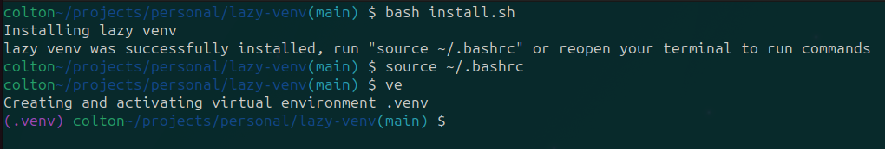
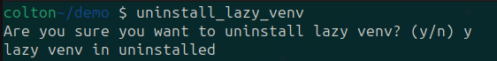
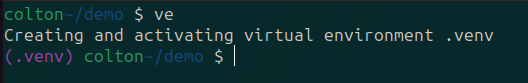
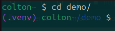
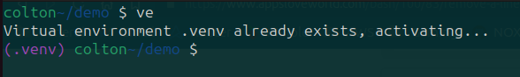
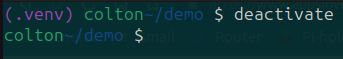
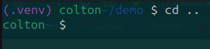

Manually creating, activating and deactivating virtual environments is a pain. None of the other solutions to solve this same problem worked like I wanted them to so I started working on this bash script to fix my problem. By using this script you won't have to manually deal with virtual environments anymore.

## Installation
To install run the install script with this command

`bash install.sh`

Then source your .bashrc file

`source ~/.bashrc`

## Uninstallation
To uninstall run the command `uninstall_lazy_venv`

## Usage

Create a vitual environment with
`ve`

Activate a virtual environment by entering a directory containing a virtual environment

If you are currently in a directory which contains a virtual environment but it is not activated the ve command will activate it

Deactivate with the usual `deactivate` command or simply exit the directory

